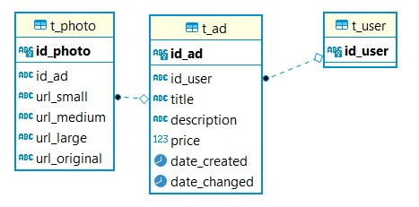

# Documentation
 
## Meshetr

> Next Generation Online Market Place

## Data Model

## Components

### Meshetr Web Interface
> web-interface

[https://meshetr.github.io/](http://34.120.16.63/catalogue/api/swagger-ui/index.html)

### Ad Catalogue API
> ad-catalogue
[http://34.120.16.63/catalogue/](http://34.120.16.63/catalogue/api/v1)

### Ad Management Service
> ad-manager
[http://34.120.16.63/manager/](http://34.120.16.63/manager/)

### Image preprocessing service
> image-processor
[http://34.120.16.63/processor/](http://34.120.16.63/processor/)

### Ad tracker API
> ad-tracker
[http://34.120.16.63/tracker/](http://34.120.16.63/tracker/)

### Ad stats API
> ad-stats
[http://34.120.16.63/insights/](http://34.120.16.63/insights/)

### Central logging Logit.io (Log4j2 via UDP)
[https://kibana.logit.io/s/ca4ac19f-0058-442d-89da-c59f0a5c8441/app/kibana#/discover?_g=()](kibana.logit.io)
