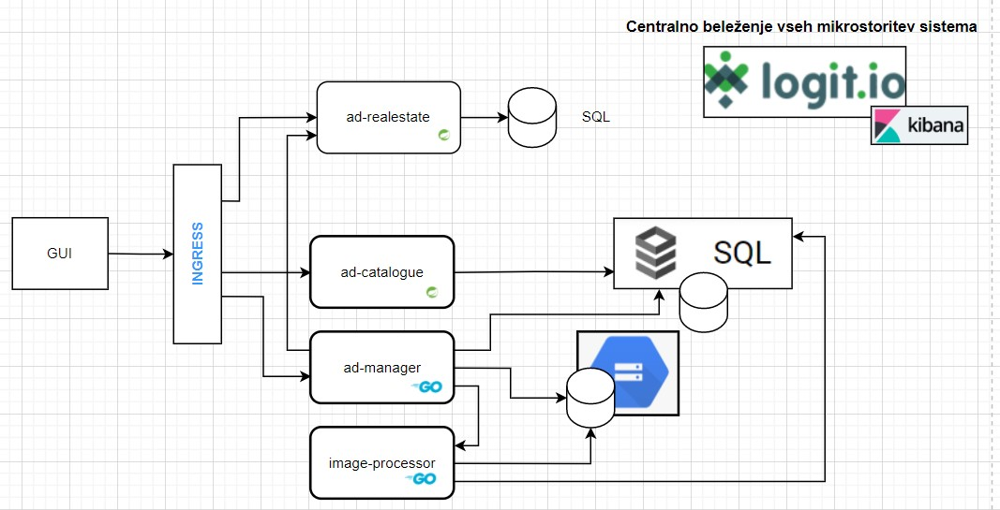
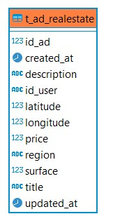

# Documentation
 
## Meshetr

> Next Generation Online Market Place

## Data Model

## Data Model 2nd Database

## Components

### Meshetr Web Interface
> web-interface

[https://meshetr.github.io/](http://34.120.16.63/catalogue/api/swagger-ui/index.html)

### Ad Catalogue API
> ad-catalogue
[http://34.120.16.63/catalogue/](http://34.120.16.63/catalogue/api/)

### Ad Realestate ads API
> ad-stats
[http://34.120.16.63/realestate/](http://34.120.16.63/realestate/api/v1)

### Ad Management Service
> ad-manager
[http://34.120.16.63/manager/](http://34.120.16.63/manager/)

### Image preprocessing service
> image-processor
[http://34.120.16.63/processor/](http://34.120.16.63/processor/)

### Central logging Logit.io (Log4j2 via UDP)
[https://kibana.logit.io/s/ca4ac19f-0058-442d-89da-c59f0a5c8441/app/kibana#/discover?_g=()](kibana.logit.io)

# Endpoints

### Ad Management Service

Ad endpoints:

| method | path           | description                             |
|--------|----------------|------------------------------------------|
| POST   | /api/v1/ad     | add another ad                           |
| PUT    | /api/v1/ad     | post updated ad information about the ad |
| DELETE | /api/v1/ad/:id | delete ad                                |

Photo endpoints:

| method | path                        | description      |
|--------|-----------------------------|-------------------|
| POST   | /api/v1/ad/:id/photo        | add another photo |
| DELETE | /api/v1/ad/:ad-id/photo/:id | delete photo      |

### Ad Catalogue Service

| method | path            | description                                        |
|--------|-----------------|----------------------------------------------------|
| GET   | /api/v1/ads      | latest 30 ads / available paging                   |
| GET    | /api/v1/ad/{id} | specific ad by id and child objects such as images |

### Ad Realestate Service

| method | path                       | description                                        |
|--------|----------------------------|----------------------------------------------------|
| POST   | /realestate/api/v1/ad      | create ad                                          |
| GET    | /realestate/api/v1/ad/{id} | get ad by id                                       |
| PUT    | /realestate/api/v1/ad/{id} | update ad by id                                    |
| DELETE | /realestate/api/v1/ad/{id} | delete ad by id                                    |

Datadog metrike:
[https://app.datadoghq.eu/screen/integration/208/kubernetes-pods-overview](https://app.datadoghq.eu/screen/integration/208/kubernetes-pods-overview)
[https://app.datadoghq.eu/screen/integration/109/kubernetes---overview](https://app.datadoghq.eu/screen/integration/109/kubernetes---overview)

logit.io:
[logit.io](https://kibana.logit.io/s/d947fd5d-ee00-40b9-9d3c-24139e66d90c/app/kibana?#/discover?_g=(filters:!(),refreshInterval:(pause:!t,value:0),time:(from:now-15m,to:now))&_a=(columns:!(kubernetes.labels.app,message,level),filters:!(),index:'8ac115c0-aac1-11e8-88ea-0383c11b333a',interval:auto,query:(language:kuery,query:'kubernetes.container.image:meshetr*'),sort:!()))